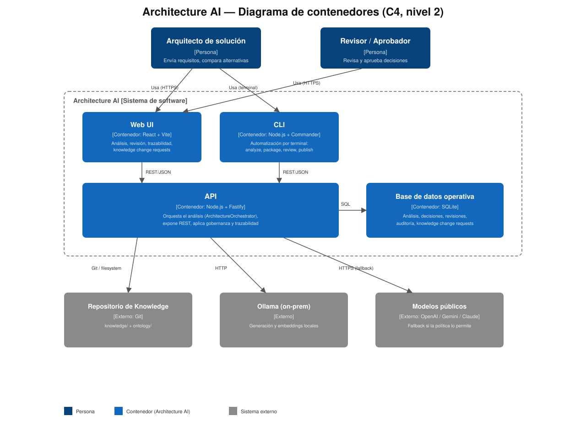

# Architecture AI MVP



Architecture AI convierte un PRD o historias de usuario en un Architecture Package trazable y restringido por evidencia. `knowledge/` y `ontology/` son el System of Record; SQLite solo guarda el estado y metadatos del análisis en la etapa MVP.

Arquitectura completa (Contexto, Contenedores, Componentes): [docs/solucion/arquitectura-c4.md](docs/solucion/arquitectura-c4.md).

## Requisitos e instalación

- Node.js 22+
- pnpm 9+

En PowerShell, asegúrate de situarte en la raíz del repositorio y de que Node esté disponible en `PATH`:

```powershell
Set-Location "D:\02-PERSONAL\01-PROJECTS\37-iaarchitecture"
$env:Path = "D:\00-PROGRAMAS\nodejs;" + $env:Path
node --version
pnpm --version
pnpm install
pnpm -r build
pnpm typecheck
```

Si `node` no aparece, la causa más habitual en Windows es que Node se instaló en una ruta distinta o que no se está ejecutando desde la carpeta correcta.

## API

En una terminal de PowerShell, desde la raíz del repositorio:

```powershell
Set-Location "D:\02-PERSONAL\01-PROJECTS\37-iaarchitecture"
$env:Path = "D:\00-PROGRAMAS\nodejs;" + $env:Path
pnpm start:api
```

El script equivalente directo también funciona:

```powershell
node scripts/start-api.mjs
```

La API queda en `http://127.0.0.1:3000` y persiste en `.architecture-ai/architecture-ai.sqlite`.

Si el puerto `3000` ya está ocupado, usa un puerto alternativo:

```powershell
$env:ARCHITECTURE_AI_PORT = "3001"
pnpm start:api
```

Endpoints: `POST /analyses`, `GET /analyses`, `GET /analyses/:id`, `GET /packages/:id`, `POST /packages/:id/generate`, `GET /packages/:id/traceability`, `GET /packages/:id/decisions`, `POST /decisions`.

Flujo de historial: crea un análisis con `POST /analyses`, consulta los resúmenes persistidos con `GET /analyses` y selecciona uno con `GET /packages/:id`. Esta última consulta es de solo lectura y devuelve el Architecture Package generado.

Por ejemplo, la generación explícita por API es:

```powershell
Invoke-RestMethod -Method Post -Uri http://127.0.0.1:3000/packages/ANALYSIS-1/generate -ContentType application/json -Body '{"outputDirectory":".architecture-ai/packages"}'
```

For `POST /analyses` from Windows PowerShell with non-ASCII characters, send UTF-8 bytes explicitly. This avoids `FST_ERR_CTP_INVALID_CONTENT_LENGTH`:

```powershell
$body = @{ requirements = 'Login con contraseña y TOTP 2FA'; knowledgeRevision = 'HEAD' } | ConvertTo-Json -Compress
$utf8Body = [System.Text.UTF8Encoding]::new($false).GetBytes($body)
Invoke-RestMethod -Method Post -Uri http://127.0.0.1:3000/analyses -ContentType 'application/json; charset=utf-8' -Body $utf8Body
```

## CLI

Con la API ejecutándose:

```powershell
pnpm --filter @architecture-ai/cli build
node apps/cli/dist/main.js analyze --requirements "Customers submit orders" --revision HEAD
node apps/cli/dist/main.js package ANALYSIS-1 --output .architecture-ai/packages/ANALYSIS-1
node apps/cli/dist/main.js review DEC-1 --action review
node apps/cli/dist/main.js review DEC-1 --action approve
node apps/cli/dist/main.js audit DEC-1
```

La CLI usa exactamente la misma API que la web. Usa `ARCHITECTURE_AI_API_URL` para cambiar la URL (también se acepta `ARCHITECTURE_AI_API`).

## Aplicación web

Con la API ejecutándose en otra terminal:

```powershell
pnpm --filter @architecture-ai/web dev
```

Abre la URL indicada por Vite, normalmente `http://localhost:5173`. La interfaz permite enviar requisitos, generar el Architecture Package, revisar decisiones, consultar auditoría y navegar la trazabilidad.

Para generar el bundle:

```powershell
pnpm --filter @architecture-ai/web build
```

## Revisión y pruebas

Una decisión significativa debe seguir `DRAFT -> REVIEWED -> APPROVED`; aprobar directamente un borrador devuelve `INVALID_REVIEW_TRANSITION`.

```powershell
node_modules\.bin\vitest.cmd run
pnpm typecheck
```

Las recomendaciones sin evidencia corporativa suficiente se mantienen como recomendaciones que requieren revisión humana; nunca se convierten silenciosamente en conocimiento aprobado.

## Gobernanza de Conocimiento

Al crear o modificar conocimiento:
- **Metadatos OKF**: Los archivos de conocimiento deben tener frontmatter OKF válido; si es inválido, el sistema rechaza su uso con `INVALID_OKF_METADATA`.
- **Propuestas Estándar**: Las nuevas guías y estándares se proponen y evalúan bajo `PENDING_REVIEW` u otro estado según el nivel.
- **Publicación Aislada**: La publicación exitosa (`POST /packages/:id/publish`) ocurre en una rama Git o worktree aislados y no modifica la rama activa por defecto.
- **Aislamiento de Revisiones**: Un nuevo documento o estándar publicado no se recuperará automáticamente con `HEAD` hasta que su revisión Git específica se seleccione explícitamente o se indique.
- **Publicación sin Aprobación**: Intentar publicar antes de la aprobación (`publish-before-approval`) está estrictamente prohibido por la API y bloqueará la transición.

---

## Reindexing, Ollama y Embeddings (configuración rápida)

Esta sección describe cómo configurar y ejecutar la reindexación de `knowledge/` para generar embeddings usando tu instancia Ollama on‑prem y persistirlos en SQLite (MVP).

Requisitos adicionales

- Instala dependencias nativas usadas por los scripts:

```bash
pnpm add -D better-sqlite3
# si tu Node no tiene fetch global, instala node-fetch
pnpm add -D node-fetch
```

Variables de entorno recomendadas

- OLLAMA_URL — URL de tu instancia Ollama (por ejemplo: http://127.0.0.1:11434)
- OLLAMA_API_KEY — (opcional) API key para Ollama si aplica
- OPENAI_API_KEY — (opcional) clave para OpenAI (placeholders posible)
- CLAUDE_API_KEY — (opcional)
- GEMINI_API_KEY — (opcional)
- SQLITE_PATH — ruta al fichero SQLite (por defecto: .architecture-ai/architecture-ai.sqlite)
- EMBEDDING_MODEL — identificador del modelo de embeddings local (por defecto: local-embed)
- GENERATION_MODEL — identificador de modelo de generación (por defecto: local-gen)

Aplicar migración SQLite (local)

Asegúrate de tener sqlite3 CLI instalado. Ejecuta:

```bash
mkdir -p .architecture-ai
sqlite3 .architecture-ai/architecture-ai.sqlite < scripts/migrations/001_init.sql
```

Reindexar knowledge usando el script

```bash
export OLLAMA_URL=http://127.0.0.1:11434
export SQLITE_PATH=.architecture-ai/architecture-ai.sqlite
export EMBEDDING_MODEL=local-embed
node scripts/ingest_embeddings.mjs --knowledge-path ./knowledge --revision HEAD
```

Opciones del script

- --knowledge-path PATH (por defecto ./knowledge)
- --revision REV (por defecto HEAD)
- --batch-size N (por defecto 8)
- --force — recalcula embeddings aunque la misma file+revision ya exista


Notas importantes

- Idempotencia: el script evita reindexar la misma combinación file/revision si ya existe una entrada, a menos que uses --force.
- Sensibilidad: archivos con frontmatter `sensitivity: true` o `sensitive: true` se omiten por defecto.
- Embeddings: se guardan como JSON en la tabla `embeddings` de SQLite (columna embedding_json). Esta es una solución de prototipo; para producción considera migrar a Postgres+pgvector o Qdrant.
- Endpoints Ollama: el script llama a `${OLLAMA_URL}/embed`. Ajusta el endpoint si tu versión de Ollama usa otro contrato.

### Modelos de embeddings recomendados (Ollama)

- **Rápido / CPU-friendly (recomendado por defecto):** `sentence-transformers/all-MiniLM-L6-v2` — 384 dimensiones. Pull:

```bash
ollama pull sentence-transformers/all-MiniLM-L6-v2
```

- **Mayor calidad (más pesado):** `sentence-transformers/all-mpnet-base-v2` — 768 dimensiones. Pull:

```bash
ollama pull sentence-transformers/all-mpnet-base-v2
```

- **Configurar en el repositorio / entorno:** establece la variable `EMBEDDING_MODEL` para usar el modelo deseado. Ejemplos:

PowerShell:

```powershell
$env:EMBEDDING_MODEL = 'sentence-transformers/all-MiniLM-L6-v2'
```

bash / macOS / Linux:

```bash
export EMBEDDING_MODEL=sentence-transformers/all-MiniLM-L6-v2
```

- **Dimensiones esperadas:** MiniLM = 384, mpnet = 768. Asegúrate de que tu motor/tabla de vectores (o configuración de indexación) esté preparado para la dimensionalidad elegida.

--

### Usar `qwen3-embedding:0.6b`

Por defecto ahora el adaptador intenta usar `qwen3-embedding:0.6b`. Si quieres emplear ese modelo explícitamente, establece la variable de entorno o deja el valor por defecto:

PowerShell:

```powershell
$env:EMBEDDING_MODEL = 'qwen3-embedding:0.6b'
```

bash:

```bash
export EMBEDDING_MODEL=qwen3-embedding:0.6b
```

Si ya has hecho `ollama pull qwen3-embedding:0.6b` en tu máquina y la descarga fue exitosa, la API usará ese modelo cuando invoques el script de ingest. Si `ollama pull qwen3-embedding:0.6b` falla, ten en cuenta:

- Ollama sólo puede `pull` modelos empaquetados y disponibles en su registro en un formato compatible (GGUF/llama.cpp u otros formatos soportados por tu versión de Ollama).
- Si recibes `pull model manifest: file does not exist` o `Repository is not GGUF or is not compatible with llama.cpp`, entonces la versión concreta no está disponible para el registro y deberás usar una alternativa:
	- Usar la librería local `sentence-transformers`/otro runtime para calcular embeddings y guardar el resultado en SQLite.
	- Buscar una versión GGUF/compatible y `pull` esa versión concreta.

Ejemplo de comando de pull (si está disponible en tu registro Ollama):

```powershell
ollama pull qwen3-embedding:0.6b
```

Si quieres, puedo añadir al script de ingest una comprobación que lea la dimensionalidad del embedding devuelto por el modelo y falle con un mensaje instructivo si no coincide con lo esperado.

- **Prueba rápida:** llama al endpoint `${OLLAMA_URL}/embed` con un payload JSON `{"model":"<modelo>","input":"texto"}` y verifica que la respuesta incluya una matriz `embedding`.


Usar la CLI (opcional)

El repositorio incluye un comando CLI `reindex` que invoca el script de ingest:

```bash
pnpm --filter @architecture-ai/cli build
architecture-ai reindex --knowledge-path ./knowledge --revision HEAD
```

¿Problemas?

Si tienes problemas con better-sqlite3 en tu sistema, puedes adaptar el script para usar el paquete `sqlite3` en su lugar o ejecutar la ingest desde un contenedor Linux.
