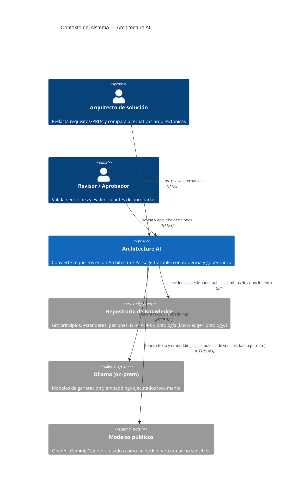
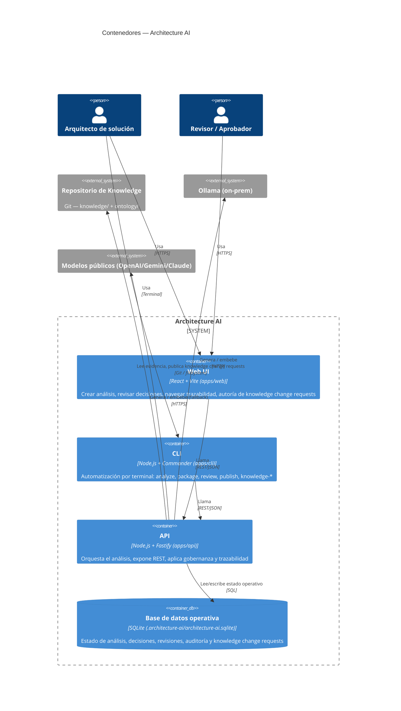
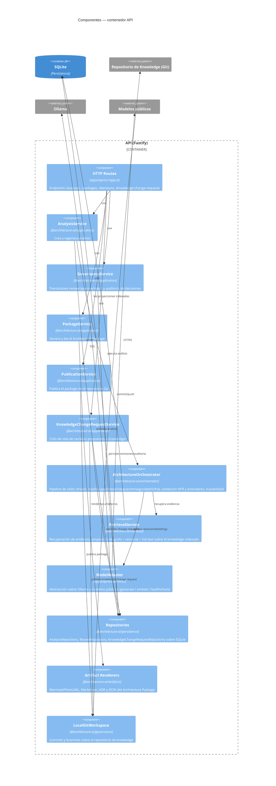

# Arquitectura de Architecture AI (modelo C4)

Fecha: 2026-08-18

Este documento describe la arquitectura del sistema **Architecture AI** siguiendo el estándar [C4 Model](https://c4model.com) (Contexto → Contenedores → Componentes), sustituyendo a los antiguos `descripcion-aplicacion.md` y `explicacion-cuatro-partes.md`, cuyo contenido narrativo queda consolidado e integrado aquí.

Architecture AI convierte requisitos de negocio o PRDs en un *Architecture Package* trazable: un conjunto de decisiones arquitectónicas respaldadas por evidencia documental, sujetas a revisión humana antes de considerarse definitivas. El sistema no genera arquitectura desde cero — cada recomendación se contrasta contra una base de conocimiento corporativa (`knowledge/` + `ontology/`) versionada en Git.

---

## Nivel 1 — Diagrama de Contexto

Muestra el sistema como una caja única, sus usuarios y los sistemas externos con los que se integra.

**Por qué importa:** el sistema nunca "adivina" arquitectura — cada respuesta depende de evidencia recuperada del repositorio de conocimiento, y el envío a modelos públicos está sujeto a política de sensibilidad de datos.

---

## Nivel 2 — Diagrama de Contenedores

Descompone Architecture AI en sus unidades desplegables.

**Nota de persistencia:** SQLite guarda el *estado de ejecución* (`analyses`, `decisions`, `reviews`, `audit_events`, `analysis_result_versions`, `knowledge_change_requests`); el repositorio Git es la *fuente de verdad documental*. Esta separación es intencional: `knowledge/` y `ontology/` nunca se mezclan con el estado transaccional.

---

## Nivel 3 — Diagrama de Componentes (contenedor API)

El contenedor **API** concentra la lógica de negocio. Sus componentes principales, organizados por *package* del monorepo:

**Sobre `ArchitectureOrchestrator`:** internamente ejecuta una cadena de *skills* (`identify-drivers`, `design-application`, `design-data`, `design-integration`, `design-security`, `design-infrastructure`, `validate-nfr`, `validate-standards`, `architecture-review`) que transforman requisitos + evidencia en drivers, recomendaciones y decisiones con trazabilidad. Se representa como un único componente porque, a nivel C4, son variaciones de una misma responsabilidad (generación de decisiones), no límites de despliegue independientes.

---

## Flujo end-to-end

1. El arquitecto envía requisitos desde la Web UI o la CLI → `POST /analyses`.
2. `AnalysisService` crea el registro y delega en `ArchitectureOrchestrator`.
3. El orquestador pide evidencia a `RetrievalService` (que combina búsqueda por palabra clave, vectorial y de grafo sobre `knowledge/` indexado).
4. El orquestador ejecuta sus skills: identifica drivers, valida NFR/estándares, genera decisiones y recomendaciones citando evidencia (`file_path`, `commit_sha`, `snippet`).
5. `AnalysisService` persiste el resultado vía `Repositories` (SQLite).
6. El revisor aprueba/rechaza decisiones vía `GovernanceService` (`POST /decisions/:id/:action`), quedando auditado.
7. `PackageService` renderiza el Architecture Package (Mermaid/PlantUML, Markdown, ADRs, JSON de trazabilidad) usando `Artifact Renderers`.
8. `PublicationService` publica el package (y `KnowledgeChangeRequestService` publica cambios a `knowledge/`) en el repositorio Git vía `LocalGitWorkspace`.

---

## Mapeo con la explicación anterior ("4 partes")

La documentación previa describía el sistema en 4 partes narrativas. Su equivalencia en términos C4:

| Parte (doc. anterior)                          | Componente(s) C4 equivalentes                                      |
|-------------------------------------------------|----------------------------------------------------------------------|
| 1. Entrada y análisis de requisitos              | `HTTP Routes` + `AnalysisService`                                    |
| 2. Recuperación de evidencia y conocimiento      | `RetrievalService` + Repositorio de Knowledge (Git)                  |
| 3. Orquestación y generación de decisiones       | `ArchitectureOrchestrator` + `ModelAdapter` + Ollama/Modelos públicos |
| 4. Persistencia, revisión y paquete final        | `Repositories` (SQLite) + `GovernanceService` + `PackageService` + `PublicationService` + `Artifact Renderers` |

---

## Gobernanza y trazabilidad (por qué esta arquitectura, no un LLM genérico)

- **Evidencia antes que opinión:** toda recomendación cita evidencia (`file_path`, `commit_sha`, `start_line`, `end_line`, `snippet`, `score`); si no hay evidencia suficiente, el sistema lo marca explícitamente en vez de inventar.
- **Trazabilidad de extremo a extremo:** `ArchitectureOrchestrator` mantiene enlaces entre requisito → driver → evidencia → recomendación → decisión → artefacto.
- **Revisión humana obligatoria:** las decisiones transitan `DRAFT → REVIEWED → APPROVED` vía `GovernanceService`; ninguna decisión significativa se acepta automáticamente.
- **Separación conocimiento/estado:** `knowledge/` + `ontology/` (Git) son la verdad documental; SQLite es solo estado de ejecución — esto permite auditar y versionar el conocimiento independientemente del histórico de análisis.
- **Sensibilidad de datos:** el `ModelAdapter` enruta según política — inputs marcados como sensibles no salen hacia modelos públicos por defecto.

---

## Referencias

- Requisitos de producto y roadmap: [PRD-Architecture-AI.md](../PRD-Architecture-AI.md)
- Ontología de conceptos arquitectónicos: `ontology/architecture-ontology.yaml`
- Estándares, principios y NFR citables como evidencia: `knowledge/`
